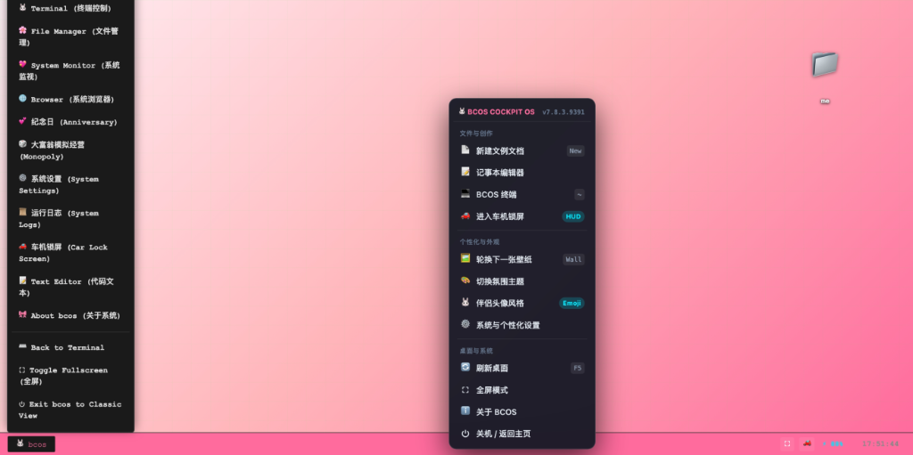

# 🐰 兔可可王国 · Bunny Cockpit OS (bcos)

> **Bunny Cockpit OS (bcos)** · 专为智能新能源车机中控大屏、桌面及移动端精心打造的沉浸式虚拟操作系统与纪念日流转空间。

[](https://github.com/kissggj123/Bunny-Cockpit-OS)
[](https://github.com/kissggj123/Bunny-Cockpit-OS)
[](LICENSE)
[](https://pages.github.com/)

---

## 🌟 项目简介

**bcos (Bunny Cockpit OS)** 是一套融合了**极客智能座舱中控锁屏**、**bcos 虚拟桌面与终端系统**、**大富翁商业模拟沙盒**以及**毫秒级纪念日流转体系**的现代化纯静态 Web / PWA 应用。

- 🚗 **智能车机深度适配**：针对蔚来 (NIO)、小鹏 (XPENG)、理想 (Li Auto)、特斯拉 (Tesla) 等智能电动汽车车机大屏比例、触控交互与暗光座舱环境深度打磨。
- 🛡️ **OLED 离散防烧屏 (Pixel Shift)**：具备分钟级 8 点离散微位移算法与静置智能微暗保护技术，消除车机长久驻留烧屏隐患。
- 💡 **屏幕常亮保持 (Screen WakeLock)**：车辆行驶或露营驻车休息时屏幕持久点亮不休眠。
- 📦 **纯静态零后端依赖**：原生纯前端架构，无需 Node 后端或数据库，支持一键部署到 GitHub Pages、Cloudflare Pages、Vercel、Docker 或任意 VPS。

---

## 📸 界面预览 (Screenshots)

### 🚗 智能座舱中控车机锁屏 (Cockpit Screen)
> 统一 28px 对称药丸胶囊状态栏 · 阶段达成率 HUD 环形仪表 · 车辆动力与 WLTP/实估双标准续航遥测 · 底部防误触滑动解锁


### 🖥️ bcos 虚拟系统桌面 (Cockpit Desktop)
> 沉浸式宽屏中控桌面 · 窗口化多任务与车机快捷应用 · 专属座舱壁纸与实时状态监控栏


### ⚙️ bcos 快捷控制中心与上下文菜单 (Context Menu & Start Menu)
> 一键直达终端、文件创作、车机锁屏 HUD、多主题切换与个性化外观


---

## 📁 项目目录结构 (Directory Tree)

```text
Bunny-Cockpit-OS/
├── .github/
│   └── workflows/
│       ├── pages.yml               # GitHub Pages 静态站点全自动部署工作流
│       └── deploy-wallpapers.yml   # 壁纸自动压缩与清单更新工作流
├── .gitignore                      # Git 追踪与忽略规则
├── .nojekyll                       # 禁用 Jekyll 静态过滤（确保 _ 开头资源可访问）
├── 404.html                        # 友好 404 引导页
├── LICENSE                         # MIT 开源许可证
├── README.md                       # 项目中文开发与部署指南
├── car.css                         # 车机锁屏专属核心样式表
├── car.html                        # 独立纯享版车机锁屏入口（推荐车机书签收藏）
├── favicon.ico                     # 网站标准 Favicon 图标
├── index.html                      # bcos 虚拟系统桌面 + 锁屏 + 大富翁沙盒主入口
├── manifest.json                   # bcos 桌面端 PWA 离线安装清单
├── manifest-car.json               # 车机锁屏独立 PWA 离线安装清单
├── optimize_wallpapers.py          # 壁纸自动化压缩与模糊占位生成脚本
├── service-worker.js               # Service Worker PWA 渐进式离线缓存管理核心
├── dist/
│   └── Bunny CC_Profile.JPG        # 默认伴舱头像照片（可自由替换）
├── docs/
│   └── screenshots/                # 文档与 README 预览截图
│       ├── bcos-desktop.png        # 虚拟桌面预览
│       ├── bcos-menu.png           # 快捷控制中心预览
│       └── cockpit-lockscreen.png  # 车机锁屏 HUD 预览
├── icon/                           # 全尺寸应用图标与 UI 矢量图形
│   ├── 16.png ~ 1024.png           # 多分辨率 PWA 图标
│   ├── icon.png                    # 标准图标
│   ├── BunnyCC_Carrot.png          # 专属徽标
│   └── *.svg                       # UI 矢量图标（按钮/方向/Logo）
├── wallpaper/                      # 座舱壁纸资源包
│   ├── IMG_2833.PNG                # 兔可可高清原图壁纸 (14MB)
│   ├── IMG_2833.min.b64.p1~p3      # 优化后的 3 分片流式秒开壁纸数据
│   ├── manifest.json               # 壁纸注册清单
│   └── placeholders.json           # 极速模糊渐进式占位图 Base64 字典
├── logs/                           # 日志存储目录（含 .gitkeep）
└── scripts/                        # 扩展脚本目录（含 .gitkeep）
```

---

## 🚀 快速部署与托管指南 (Deployment)

bcos 为**纯静态应用**，无需安装复杂后端数据库，您可以根据喜好选择以下任意一种托管方式：

### 方案一：GitHub Pages 一键免服务器部署（最推荐 · 零成本）

1. **Fork 本仓库**：点击右上角 `Fork` 将项目复制到您的个人 GitHub 账号下。
2. **启用 GitHub Pages**：
   - 进入您 Fork 后的仓库，点击 **Settings** ➔ **Pages**。
   - 在 **Build and deployment** 下方的 **Source** 中选择 **`GitHub Actions`**。
   - 仓库已自带完整的 [`.github/workflows/pages.yml`](.github/workflows/pages.yml) 自动化构建流程。
3. **完成部署**：
   - 当仓库发生推选或手动在 **Actions** 面板触发 `Deploy GitHub Pages` 后，约 1 分钟即可就绪。
   - 访问地址通常为：`https://<你的用户名>.github.io/Bunny-Cockpit-OS/`。

> [!TIP]
> 如果您想以仓库分支直接部署，亦可在 **Source** 中选择 **Deploy from a branch**，分支选择 `main` 或 `master`，路径保持 `/ (root)` 并点击 Save 即可。

---

### 方案二：Cloudflare Pages / Vercel（全球 CDN 加速 · 国内秒开）

如果您追求国内车机与移动端的极致加载速度，推荐接入免费的全球边缘 CDN：

#### ☁️ Cloudflare Pages (推荐)
1. 登录 [Cloudflare Dashboard](https://dash.cloudflare.com/) ➔ 进入 **Workers & Pages** ➔ **Create application** ➔ **Pages**。
2. 连接您的 GitHub 账号并选取 `Bunny-Cockpit-OS` 仓库。
3. **构建设置**：
   - **Framework preset**：`None`
   - **Build command**：留空
   - **Build output directory**：留空或填 `.`
4. 点击 **Save and Deploy**，即可获得全球 Anycast CDN 加速的专属域名，支持免费绑定个人自定义域名。

#### ▲ Vercel
1. 登录 [Vercel](https://vercel.com/) ➔ 点击 **Add New...** ➔ **Project**。
2. Import 您的 `Bunny-Cockpit-OS` 仓库，Framework Preset 选择 **Other**，Build & Output Settings 保持默认。
3. 点击 **Deploy** 即可。

---

### 方案三：自建 VPS / 私有服务器 (Linux / Nginx / Caddy / Docker)

如果您拥有独立的云服务器（阿里云 / 腾讯云 / 华为云 / AWS 等），可以通过以下方式部署：

#### 1. Nginx 部署
将代码上传至服务器目录（如 `/var/www/bunny-cockpit-os`），在 Nginx 配置中添加站点：

```nginx
server {
    listen 80;
    listen [::]:80;
    server_name cockpit.yourdomain.com; # 替换为您自己的域名

    root /var/www/bunny-cockpit-os;
    index index.html;

    # 开启 Gzip 静态压缩
    gzip on;
    gzip_min_length 1k;
    gzip_comp_level 6;
    gzip_types text/plain text/css application/json application/javascript image/svg+xml;

    # 静态资源缓存策略
    location ~* \.(jpg|jpeg|png|gif|ico|svg|webp)$ {
        expires 30d;
        add_header Cache-Control "public, no-transform";
    }

    # Service Worker 与 HTML 不缓存，确保即时版本更新
    location ~* (service-worker\.js|index\.html|car\.html)$ {
        expires -1;
        add_header Cache-Control "no-store, no-cache, must-revalidate";
    }

    location / {
        try_files $uri $uri/ /index.html;
    }
}
```

#### 2. Docker 一键启动
只需一条命令即可通过官方精简版 Nginx 镜像运行：

```bash
# 进入仓库根目录并启动容器
docker run -d \
  --name bunny-cockpit-os \
  -p 8080:80 \
  -v $(pwd):/usr/share/nginx/html:ro \
  --restart always \
  nginx:alpine
```
浏览器访问 `http://<服务器IP>:8080` 即可开始使用。

#### 3. 本地快速预览
在本地电脑测试，无需安装任何 Web 容器：
```bash
# Python 3
python3 -m http.server 8080

# 或 Node.js
npx serve -l 8080
```

---

## 🛠️ 个性化定制指南 (Customization)

### 1. 修改专属起始纪念日与倒计时
在 [`index.html`](index.html) 与 [`car.html`](car.html) 中搜索 `START_DATE`，将其修改为您专属的纪念日日期：
```javascript
// 修改为您专属的纪念日期（格式：YYYY/MM/DD HH:mm:ss）
const START_DATE = '2024/03/12 00:00:00';
```

### 2. 替换专属伴舱头像
- 将您喜欢的头像照片重命名为 **`Bunny CC_Profile.JPG`**。
- 替换项目目录中的 [`dist/Bunny CC_Profile.JPG`](dist/Bunny%20CC_Profile.JPG) 文件。
- 车机锁屏、虚拟桌面、启动画面及中控头像将全端同步焕新。

### 3. 添加与更新座舱壁纸
1. 将准备好的高清壁纸图片（支持 JPG、PNG、JPEG）放入 [`wallpaper/`](wallpaper/) 文件夹。
2. 运行仓库自带的自动化压缩脚本：
   ```bash
   python3 optimize_wallpapers.py
   ```
   脚本会自动生成轻量化的渐进式压缩文件，并同步更新 [`wallpaper/manifest.json`](wallpaper/manifest.json) 与秒开模糊占位图。

---

## 🚗 车机中控大屏最佳使用姿势

1. **车机内置浏览器访问**：
   - 打开蔚来 / 小鹏 / 理想 / 特斯拉车机自带浏览器，输入您的部署网址。
   - **主入口**（虚拟桌面 + 锁屏 + 大富翁）：`https://your-domain.com/`
   - **独立纯享版车机锁屏**（极力推荐收藏在车机书签）：`https://your-domain.com/car.html`
2. **沉浸全屏**：
   - 点击右上角「⚙️ 导航设置」或控制栏中的「⛶ 全屏」按钮，浏览器将自动隐藏顶部地址栏与底部状态栏。
3. **常亮保持**：
   - 点击顶部状态栏的「💡 常亮保持」胶囊，车辆行驶或驻车休息时屏幕将保持点亮不自动锁屏休眠。
4. **动力与续航遥测调校**：
   - 点击右上角「⚡ 动力设置」，输入爱车真实的电池剩余电量（SoC 0%~100%），支持自由切换 **WLTP 国家标准工况** 或 **动态实估工况**。

---

## 📱 PWA 本地安装与离线运行

- **iOS Safari**：点击底部工具栏「分享」按钮 ➔ 选择「添加到主屏幕」。
- **Chrome / Edge**：点击地址栏右侧的「安装应用」图标 ➔ 点击「安装」。
- **车机端**：支持添加到中控负一屏或快捷方式，断网离线秒级启动。

---

## 🛠️ 技术栈与架构设计

- **前端架构**：原生 Vanilla JavaScript (ES6+)、HTML5、现代 CSS3 (CSS Grid, Flexbox, Clamp fluid layout, Backdrop-filter)
- **字体引擎**：Cross-platform native font-stack (SF Pro, Segoe UI, PingFang SC, HarmonyOS Sans)
- **视觉动效**：SVG 矢量仪表盘、CSS3 GPU 硬件加速动画、音频律动 EQ 模拟器
- **离线与缓存**：Service Worker Cache API、Web App Manifest
- **设备互联**：Screen Wake Lock API、Fullscreen API、Touch / Pointer Events API

---

## 📋 版本更新日志

### **v7.8.4.9410** *(当前版本)*
- **车机锁屏壁纸多维自适应引擎**：全面引入 5 种专业壁纸缩放自适应模式（Fill Screen 充满屏幕、Fit to Screen 适应屏幕等比完整、Stretch to Fill Screen 强制拉伸填满、Center 居中原始1:1像素、Tile 平铺横纵阵列网格），方便车机中控大屏、竖屏、异形屏自适应不同的壁纸。
- **macOS 原生级半透明雾面玻璃 Popover 菜单**：打造与系统级桌面一致的浮动下拉弹窗体验（blur 28px + 12px 圆角 + 选定项勾选「✓」指示），在壁纸管理弹窗与快捷控制中心全端同步，同时支持在锁屏背景空白处右键呼出浮动菜单与按键盘 `Escape` 键随时收起。

---

### **v7.8.4.9409**
- **消除非全屏状态下「累计航程」与时间的不对齐缺陷**：精准定位并修复在窗口非全屏时下边距破坏 Flex 对齐的问题，重构为高精度独立居中微胶囊架构。
- **开源发布与环境解耦**：完成核心干净资产梳理与开源代码仓初始化，支持 GitHub Pages、Cloudflare、Docker 等一键自由部署。

---

## 📄 开源许可证

本项目基于 [MIT License](LICENSE) 开源。欢迎大家 Star、Fork，提出 Issue 与 PR 一起共建属于智能车机的沉浸式数字座舱！
